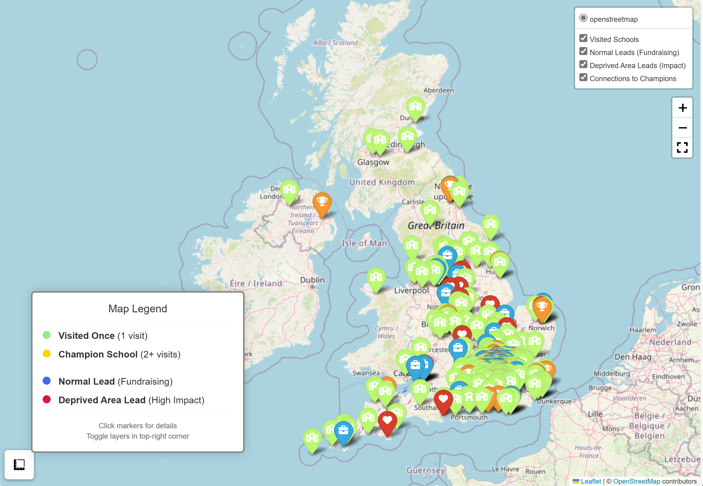

# Breck Foundation Impact Intelligence Platform

**Top 3 Finalist - JP Morgan Data for Good Hackathon 2025**

A comprehensive data analytics framework designed to help the Breck Foundation maximize the impact of their cyber safety education programs through data-driven insights, geographic optimization, and strategic lead generation.

---

## Interactive Map Visualization

<div align="center">

[](https://archer-paul.github.io/cyber-safety-jpmorgan-data4good/)

**[Click to explore the interactive map](https://archer-paul.github.io/cyber-safety-jpmorgan-data4good/)**

</div>

The interactive map showcases:
- **Visited Schools**: Color-coded by engagement level (single visit, multiple visits, champion schools)
- **Normal Leads**: High-priority fundraising opportunities (schools in same trusts or geographic clusters)
- **Deprived Area Leads**: High-impact social opportunities (schools in disadvantaged areas with FSM% ≥ 30%)
- **Strategic Connections**: Visual pathways linking new leads to established champion schools

> Note: Click the image above to open the full interactive version on GitHub Pages with zoom, filters, and detailed popups.

---

## Table of Contents

- [Overview](#overview)
- [Key Features](#key-features)
- [Project Architecture](#project-architecture)
- [Installation](#installation)
- [Quick Start](#quick-start)
- [Core Modules](#core-modules)
- [Outputs](#outputs)
- [Methodology](#methodology)
- [Use Cases](#use-cases)
- [Contributing](#contributing)
- [Acknowledgments](#acknowledgments)

---

## Overview

### The Challenge

The Breck Foundation delivers critical cyber safety education to schools across the UK, but faces challenges in:
- Measuring long-term program effectiveness
- Identifying geographic coverage gaps
- Optimizing resource allocation
- Generating qualified leads for program expansion
- Demonstrating impact for fundraising purposes

### Our Solution

This platform provides an end-to-end analytics solution that:

1. **Analyzes Workshop Impact**: Processes pre/post surveys, attendance records, and multi-stakeholder feedback (youth, adults, teachers) to quantify program effectiveness across demographics, geographies, and delivery methods.

2. **Extracts Qualitative Insights**: Employs advanced NLP techniques (sentiment analysis, theme categorization, keyword extraction) to identify what works, what doesn't, and why.

3. **Maps Geographic Coverage**: Geocodes and visualizes all workshop locations, performs clustering analysis to identify hotspots and gaps, and calculates optimal expansion territories.

4. **Generates Strategic Leads**: Implements a dual-track lead generation system:
   - **Normal Leads**: Schools in same Multi-Academy Trusts (MATs) or geographic proximity to champions - optimized for fundraising efficiency
   - **Deprived Area Leads**: Schools in high-deprivation areas (FSM% ≥ 30%) - optimized for social impact

5. **Produces Actionable Recommendations**: Synthesizes findings into prioritized, evidence-based recommendations for program improvement, resource allocation, and strategic expansion.

### Impact

- **440+ youth survey responses** analyzed across demographics and time periods
- **50+ unique schools** geocoded and mapped with visit frequency tracking
- **200+ qualified leads** generated and scored for outreach prioritization
- **5 data collection gaps** identified with specific remediation steps
- **Interactive visualizations** enabling real-time exploration and presentation

---

## Key Features

### Comprehensive Data Integration
- Ingests and harmonizes 7+ data sources from Excel workbooks
- Handles inconsistent schemas, missing values, and temporal variations
- Extracts maximum value from existing data collection efforts

### Multi-Dimensional Effectiveness Analysis
- Age group breakdowns (11-13, 14-16, 17-18)
- Gender-based insights
- Geographic patterns and trends
- Temporal evolution (month-over-month)
- Confidence metrics across cyber safety domains
- Delivery method comparisons (in-person, external speakers, assemblies)

### Advanced Natural Language Processing
- Sentiment analysis on free-text feedback
- Automated keyword and bigram extraction
- Theme categorization (grooming awareness, online safety, educational value)
- Improvement suggestion mining
- Extensible for cyber safety news trend analysis

### Geographic Intelligence
- Multi-provider geocoding with UK-specific optimizations
- K-means and DBSCAN clustering algorithms
- Coverage gap identification and quantification
- Interactive Folium-based mapping with custom markers and popups
- Heat mapping for concentration analysis

### Dual-Track Lead Generation
- **Trust-Based Leads**: Leverages Multi-Academy Trust relationships for warm introductions
- **Geographic Hotspot Leads**: Identifies schools near proven champions (configurable radius)
- **Deprivation-Focused Leads**: Targets high-FSM schools for maximum social impact
- **Champion Connections**: Links each lead to nearest champion school for relationship-building

### Professional Outputs
- JSON exports for programmatic consumption
- Executive summary reports for stakeholders
- Detailed recommendation documents by category
- Interactive HTML maps for presentations
- CSV lead lists ready for CRM import

---

## Project Architecture

```
breck-impact-intelligence/
│
├── breck_master_runner.py              # Orchestration pipeline - run this
├── breck_comprehensive_framework.py    # Core data loading & analysis
├── breck_nlp_advanced.py              # Natural language processing
├── breck_geographic_clustering.py      # Geographic analysis & mapping
├── breck_lead_generator_v2.py         # Dual-track lead generation
├── breck_interactive_map_generator.py  # Interactive map visualization
│
├── requirements.txt                    # Python dependencies
├── README.md                          # This file
│
├── data/
│   ├── Breck_Internal_Data.xlsx       # Primary data source (not in repo)
│   └── edubasealldata20251024.csv     # UK schools database (not in repo)
│
└── outputs/                           # Generated artifacts
    ├── breck_complete_analysis.json   # Complete analysis results
    ├── breck_nlp_results.json         # NLP insights
    ├── breck_executive_summary.txt    # Executive summary
    ├── breck_recommendations.txt      # Detailed recommendations
    ├── breck_interactive_map.html     # Interactive map (PRIMARY OUTPUT)
    ├── normal_leads.csv               # Fundraising-optimized leads
    ├── deprived_area_leads.csv        # Impact-optimized leads
    └── schools_with_geocoding.csv     # Geocoded school locations
```

---

## Installation

### Prerequisites
- Python 3.8 or higher
- 500MB disk space
- Internet connection (for geocoding APIs)

### Dependencies

Install all required packages:

```bash
pip install pandas numpy openpyxl scipy scikit-learn geopy requests matplotlib seaborn folium
```

Or use the requirements file:

```bash
pip install -r requirements.txt
```

### Optional: Enhanced NLP

For advanced text processing capabilities:

```bash
pip install nltk spacy textblob rapidfuzz
python -m spacy download en_core_web_sm
```

### Data Sources

You'll need two data files (not included in repository):

1. **Breck Internal Data**: The Breck Foundation's workshop data Excel file
2. **GIAS Database**: UK schools database from [Get Information About Schools](https://get-information-about-schools.service.gov.uk/Downloads)

Update the paths in `breck_master_runner.py` configuration:

```python
CONFIG = {
    'data_file': '/path/to/Breck_Internal_Data.xlsx',
    'gias_database': '/path/to/edubasealldata.csv',
    # ... other settings
}
```

---

## Quick Start

### Run Complete Analysis

Execute the master pipeline to generate all outputs:

```bash
python breck_master_runner.py
```

The pipeline will:
1. Load and clean all data sources
2. Perform effectiveness analysis
3. Identify data collection gaps
4. Analyze session delivery patterns
5. Run NLP analysis on feedback text
6. Generate geographic visualizations
7. Create normal and deprived area lead lists
8. Build interactive map
9. Export all results and recommendations

### View Results

1. **Open the interactive map**: `outputs/breck_interactive_map.html` in any web browser
2. **Review executive summary**: `outputs/breck_executive_summary.txt`
3. **Examine leads**: `outputs/normal_leads.csv` and `outputs/deprived_area_leads.csv`
4. **Explore recommendations**: `outputs/breck_recommendations.txt`

---

## Core Modules

### 1. Comprehensive Framework (`breck_comprehensive_framework.py`)

**Purpose**: Data loading, cleaning, and core effectiveness analysis

**Key Classes**:
- `BreckDataLoader`: Handles all Excel sheets with intelligent header detection and data harmonization
- `BreckComprehensiveAnalyzer`: Performs multi-dimensional effectiveness analysis

**Key Functions**:
```python
# Load data
loader = BreckDataLoader('/path/to/data.xlsx')
loader.load_all_sheets()
loader.clean_young_person_feedback()
loader.clean_adult_feedback()
loader.parse_all_session_data()

# Analyze
analyzer = BreckComprehensiveAnalyzer(loader)
effectiveness = analyzer.analyze_program_effectiveness()
gaps = analyzer.analyze_data_collection_gaps()
sessions = analyzer.analyze_session_delivery()
```

**Outputs**:
- Youth feedback analysis (440 responses)
- Adult feedback analysis (42 responses)
- Class feedback analysis (85 responses)
- Session delivery trends
- Data quality assessment

---

### 2. NLP Module (`breck_nlp_advanced.py`)

**Purpose**: Extract insights from free-text feedback

**Key Classes**:
- `TextPreprocessor`: Tokenization, stopword removal, normalization
- `FeedbackTextAnalyzer`: Sentiment analysis, keyword extraction, theme categorization
- `CyberSafetyNewsAnalyzer`: Track external cyber safety trends (optional)

**Key Features**:
- Keyword extraction with frequency analysis
- Bigram and n-gram identification
- Theme categorization (grooming, safety, educational, content quality)
- Sentiment scoring (positive/negative/neutral)
- Improvement suggestion clustering

**Usage**:
```python
from breck_nlp_advanced import run_complete_nlp_analysis

nlp_results = run_complete_nlp_analysis(feedback_df, news_df=None)
```

**Outputs**:
- Top keywords by category
- Theme distributions
- Sentiment scores
- Common improvement suggestions

---

### 3. Geographic Module (`breck_geographic_clustering.py`)

**Purpose**: Map schools, identify patterns, and find coverage gaps

**Key Classes**:
- `SchoolGeocoder`: Multi-provider geocoding with UK optimizations
- `GeographicCluster`: K-means and DBSCAN clustering
- `GeographicVisualizer`: Interactive Folium maps

**Key Features**:
- Automatic geocoding using Nominatim, UK Postcode API fallbacks
- Clustering to identify concentration areas
- Coverage gap calculation
- Interactive maps with custom markers
- Heat maps showing workshop density

**Usage**:
```python
from breck_geographic_clustering import run_geographic_analysis

geo_results = run_geographic_analysis(schools, n_clusters=5)
```

**Outputs**:
- Geocoded school coordinates
- Cluster assignments
- Coverage gap metrics
- Interactive HTML map

---

### 4. Lead Generator (`breck_lead_generator_v2.py`)

**Purpose**: Generate qualified leads for program expansion

**Dual-Track System**:

#### Track 1: Normal Leads (Fundraising)
- **Trust Leads**: Schools in same Multi-Academy Trusts as champions
- **Hotspot Leads**: Schools within configurable radius (default 5km) of champions

Optimized for:
- Warm introduction opportunities
- Fundraising efficiency
- Geographic clustering benefits

#### Track 2: Deprived Area Leads (Social Impact)
- Schools with Free School Meals (FSM) ≥ 30%
- Prioritizes socio-economically disadvantaged areas

Optimized for:
- Maximum social impact
- Grant eligibility demonstration
- Mission alignment

**Key Features**:
- Fuzzy name matching for school identification
- British National Grid (BNG) to WGS84 coordinate conversion
- Champion school connection mapping
- Priority/impact scoring algorithms
- Automatic deduplication

**Usage**:
```python
from breck_lead_generator_v2 import EnhancedLeadGenerator

config = {
    'champion_min_visits': 2,
    'hotspot_radius_km': 5.0,
    'fsm_threshold': 30.0,
    # ... output paths
}

generator = EnhancedLeadGenerator(breck_schools, gias_path, config)
normal_leads, deprived_leads = generator.run_complete_lead_generation()
```

**Outputs**:
- `normal_leads.csv`: Top 100 fundraising-optimized leads
- `deprived_area_leads.csv`: Top 100 impact-optimized leads
- Both include: school details, nearest champion, distance, priority/impact score

---

### 5. Interactive Map Generator (`breck_interactive_map_generator.py`)

**Purpose**: Create stunning visualizations for presentations and exploration

**Map Features**:
- **Visited Schools**:
  - Light green: 1 visit
  - Gold: 2+ visits (champions)
- **Normal Leads**: Blue markers with briefcase icons
- **Deprived Area Leads**: Red markers with heart icons
- **Connection Lines**: Dashed lines linking leads to nearest champions
- **Interactive Popups**: Detailed school information on click
- **Layer Controls**: Toggle visibility of different marker types
- **Legend**: Clear color-coded guide
- **Fullscreen Mode**: Enhanced presentation view
- **Measure Tool**: Calculate distances

**Usage**:
```python
from breck_interactive_map_generator import generate_interactive_map

config = {
    'visited_schools_file': 'outputs/schools_with_geocoding.csv',
    'normal_leads_file': 'outputs/normal_leads.csv',
    'deprived_leads_file': 'outputs/deprived_area_leads.csv',
    'map_output_path': 'outputs/breck_interactive_map.html',
    'max_connections_per_lead': 2
}

map_path = generate_interactive_map(config)
```

**Output**:
- `breck_interactive_map.html`: Fully self-contained interactive map

---

### 6. Master Runner (`breck_master_runner.py`)

**Purpose**: Orchestrate the complete analysis pipeline

**Execution Phases**:
1. **Data Loading**: Load and clean all Excel sheets
2. **Effectiveness Analysis**: Calculate program impact metrics
3. **Gap Analysis**: Identify missing data points
4. **Session Analysis**: Track delivery patterns over time
5. **NLP Analysis**: Extract text insights
6. **Geographic Analysis**: Map and cluster schools
7. **Lead Generation**: Create dual-track lead lists
8. **Interactive Map**: Generate visualization
9. **Recommendations**: Synthesize actionable insights
10. **Export**: Save all results

**Configuration**:
Edit the `CONFIG` dictionary in `breck_master_runner.py`:

```python
CONFIG = {
    'data_file': '/path/to/Breck_Internal_Data.xlsx',
    'gias_database': '/path/to/edubasealldata.csv',
    'output_dir': './outputs',
    'n_clusters': 5,
    'champion_min_visits': 2,
    'hotspot_radius_km': 5.0,
    'fsm_threshold': 30.0,
    # ... other settings
}
```

---

## Outputs

### Primary Outputs

| File | Description | Use Case |
|------|-------------|----------|
| `breck_interactive_map.html` | Interactive geographic visualization | Presentations, exploration, stakeholder demos |
| `normal_leads.csv` | Top 100 fundraising-optimized leads | CRM import, outreach planning, donor reports |
| `deprived_area_leads.csv` | Top 100 impact-optimized leads | Grant applications, social impact reporting |
| `breck_complete_analysis.json` | Complete analysis results | Programmatic access, further analysis, archival |
| `breck_executive_summary.txt` | Human-readable summary | Executive briefings, quick reviews |
| `breck_recommendations.txt` | Categorized recommendations | Action planning, priority setting |

### Secondary Outputs

| File | Description |
|------|-------------|
| `breck_nlp_results.json` | Detailed NLP insights |
| `schools_with_geocoding.csv` | Geocoded school database |
| `school_summary.csv` | Visit frequency by school |

---

## Methodology

### Effectiveness Measurement

We calculate program effectiveness using:

1. **Pre/Post Confidence Metrics**: Change in cyber safety confidence across domains
2. **Satisfaction Scores**: 5-point Likert scale analysis
3. **Recommendation Likelihood**: Net Promoter Score (NPS) analog
4. **Engagement Factors**: External speaker impact, assembly vs. workshop differences
5. **Demographic Segmentation**: Age, gender, school-level variations

### NLP Analysis

Text processing pipeline:
1. **Preprocessing**: Lowercasing, punctuation removal, tokenization
2. **Stopword Removal**: Custom cyber-safety-aware stopword list
3. **Keyword Extraction**: Frequency-based with domain relevance filtering
4. **Theme Categorization**: Rule-based classification using domain keywords
5. **Sentiment Analysis**: Polarity scoring (positive/negative/neutral)
6. **Bigram Analysis**: Identify common phrase patterns

### Geographic Analysis

Clustering methodology:
1. **Geocoding**: Multi-provider cascade (Nominatim → UK Postcode API → manual)
2. **Coordinate Normalization**: WGS84 standard for compatibility
3. **Distance Calculation**: Haversine formula via geopy
4. **Clustering**: K-means for defined clusters, DBSCAN for density-based
5. **Gap Identification**: Schools beyond target radius from any cluster center

### Lead Scoring

#### Normal Leads (Fundraising Priority)
```
priority_score = trust_match_bonus (10 points) + proximity_score (0-5 points)
proximity_score = 5 * (1 - distance_to_champion / max_distance)
```

#### Deprived Area Leads (Impact Priority)
```
impact_score = 10 * (fsm_percentage / max_fsm_percentage)
```

Leads are ranked by score and limited to top 100 for operational feasibility.

---

## Use Cases

### For Breck Foundation Leadership

- **Strategic Planning**: Identify high-priority expansion areas based on geographic gaps and lead scores
- **Fundraising**: Demonstrate impact with data-driven metrics and visualization
- **Resource Allocation**: Optimize workshop delivery based on effectiveness analysis
- **Impact Reporting**: Generate compelling narratives for donors and grant applications

### For Outreach Teams

- **Lead Prioritization**: Focus on top-scored opportunities with connection pathways
- **Warm Introductions**: Leverage champion school relationships for new school outreach
- **Territory Planning**: Use geographic clusters to plan efficient multi-school visits

### For Program Managers

- **Content Improvement**: Identify themes from feedback to refine workshop content
- **Delivery Optimization**: Understand what works (external speakers, interactive elements)
- **Data Collection**: Address identified gaps to improve future analysis

### For Researchers & Analysts

- **Further Analysis**: Use JSON exports for custom analysis
- **Model Development**: Build predictive models for workshop effectiveness
- **Trend Analysis**: Track changes over time with temporal data

---

## Customization

### Adjust Analysis Parameters

Edit `CONFIG` in `breck_master_runner.py`:

```python
CONFIG = {
    # Geographic clustering
    'n_clusters': 7,  # Increase for finer-grained clustering

    # Lead generation
    'champion_min_visits': 3,  # Stricter champion definition
    'hotspot_radius_km': 10.0,  # Wider geographic reach
    'fsm_threshold': 25.0,  # Lower deprivation threshold

    # Other settings
    'create_visualizations': True,
    'analyze_news': False  # Enable when news data available
}
```

### Add Custom NLP Themes

Edit `breck_nlp_advanced.py`:

```python
theme_keywords = {
    'Your_Custom_Theme': ['keyword1', 'keyword2', 'keyword3'],
    'Another_Theme': ['term1', 'term2'],
    # ... existing themes
}
```

### Modify Clustering Algorithm

Edit `breck_geographic_clustering.py`:

```python
# Use DBSCAN instead of K-means for density-based clustering
clustered_df = analyzer.perform_dbscan_clustering(eps=0.5, min_samples=3)
```

### Customize Map Appearance

Edit `breck_interactive_map_generator.py`:

```python
COLORS = {
    'visited_once': '#YOUR_COLOR',
    'champion': '#YOUR_COLOR',
    'normal_lead': '#YOUR_COLOR',
    # ...
}
```

---

## Troubleshooting

### Common Issues

#### Geocoding Failures
**Symptom**: Few schools geocoded, warnings about geocoding failures

**Solutions**:
- Add postcodes to school data for improved accuracy
- Check internet connection
- Use UK Postcode API as fallback:
  ```python
  geocoder.use_uk_postcode_api(postcodes)
  ```

#### Import Errors
**Symptom**: `ModuleNotFoundError` when running scripts

**Solution**:
```bash
pip install [missing_module]
```

#### Excel Reading Errors
**Symptom**: Cannot read certain sheets, encoding errors

**Solutions**:
- Ensure file is `.xlsx` format (not `.xls`)
- Try opening and re-saving in Excel
- Check file path is correct

#### Memory Issues
**Symptom**: Out of memory errors with large datasets

**Solutions**:
- Process data in chunks
- Reduce `n_clusters` parameter
- Limit lead output to fewer results

#### GIAS Database Issues
**Symptom**: Lead generation fails, no GIAS schools loaded

**Solutions**:
- Download latest GIAS database from [official source](https://get-information-about-schools.service.gov.uk/Downloads)
- Check file path in configuration
- Ensure file is CSV format with correct encoding (UTF-8 or Latin-1)

### Debug Mode

Enable detailed logging:

```python
import logging
logging.basicConfig(level=logging.DEBUG)
```

Add to the top of any script for verbose output.

---

## Contributing

### For Hackathon Team

When adding features:
1. Document all modifications with clear comments
2. Update this README with new capabilities
3. Add examples to relevant module documentation
4. Test with sample data before committing
5. Share insights and learnings with the team

### Code Style

- Follow PEP 8 conventions
- Use type hints where applicable
- Write docstrings for all functions and classes
- Keep functions focused and modular

### Testing

Before committing:
```bash
# Run complete pipeline
python breck_master_runner.py

# Verify all outputs generated
ls outputs/

# Check interactive map loads in browser
```

---

## Acknowledgments

### JP Morgan Data for Good Hackathon 2025

This project was developed as part of the JP Morgan Data for Good Hackathon 2025, where our team achieved **Top 3 Finalist** status. We are grateful to JP Morgan for organizing this impactful event and providing the opportunity to apply data science for social good.

### The Breck Foundation

Special thanks to the Breck Foundation for their critical mission to keep young people safe online. Their dedication to cyber safety education inspired this work, and we hope this platform helps amplify their impact across the UK.

### Team Members

This project was made possible by the collaborative efforts of our talented team:

- **Arush Gupta** - Mathematics and Computer Science, University of Oxford
- **Ethan McElhone** - MSc Statistics, LSE
- **Kevin Y** - BSc Financial Mathematics and Statistics, LSE
- **Rayaan Sheikh** - MSc AI, QMUL

### Mentors & Organizers

We are deeply grateful to our mentors from JP Morgan who provided invaluable guidance throughout the hackathon:

- **Andrea Soldà** - Executive Director, Applied AI at JPMorgan
- **Yunfan Zou** - Quantitative Research Associate at J.P. Morgan

Their expertise and support were instrumental in shaping this project and achieving our Top 3 Finalist status.

### Technology Stack

- **Data Processing**: pandas, numpy
- **Machine Learning**: scikit-learn (clustering)
- **NLP**: nltk, spacy, textblob
- **Geocoding**: geopy, Nominatim, UK Postcode API
- **Visualization**: folium, matplotlib, seaborn
- **Fuzzy Matching**: rapidfuzz, difflib

---

## License

Developed for the JP Morgan Data for Good Hackathon 2025 in support of the Breck Foundation's mission.

---

## Contact & Support

For questions, suggestions, or collaboration opportunities:

- **GitHub Issues**: [Report bugs or request features](../../issues)
- **Breck Foundation**: Visit [breckfoundation.org](https://www.breckfoundation.org) to learn more about their work

---

## Next Steps

### Immediate Actions

1. Open `outputs/breck_interactive_map.html` to explore the visualization
2. Review `outputs/normal_leads.csv` for fundraising priorities
3. Review `outputs/deprived_area_leads.csv` for impact priorities
4. Read `outputs/breck_recommendations.txt` for action items
5. Present findings to Breck Foundation stakeholders

### Future Enhancements

- **Automated Reporting**: Schedule regular analysis runs with email summaries
- **Predictive Modeling**: Build models to predict workshop effectiveness pre-delivery
- **Integration with CRM**: Direct export to Salesforce or similar platforms
- **Real-Time Dashboard**: Web-based dashboard for live monitoring
- **Trend Analysis**: Track changes over multiple years
- **A/B Testing Framework**: Test workshop variations systematically
- **External News Integration**: Automated cyber safety news aggregation and analysis

---

**Built with data science for social impact. Empowering the Breck Foundation to create a safer digital world for young people.**
